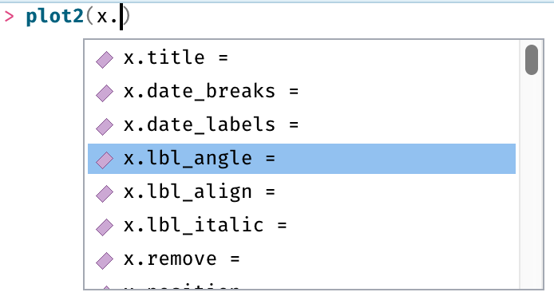

```{r, include = FALSE}
knitr::opts_chunk$set(
  fig.width = 6,
  fig.height = 4,
  collapse = TRUE,
  comment = "#>"
) 
library(certeplot2)
# load this as well, so function names will get tidyverse links on the website
library(patchwork)
library(dplyr, warn.conflicts = FALSE)
args <- names(formals(plot2))
x_settings <- args[grepl("^x[.]", args)]
category_settings <- args[grepl("^category[.]", args)]
facet_settings <- args[grepl("^facet[.]", args)]
exported <- getNamespaceExports("certeplot2")
all_ls <- ls(envir = asNamespace("certeplot2"))
reexported <- sort(exported[!exported %in% c(all_ls, "big_mark", "dec_mark")])
```

# Introduction

*Plotting with `plot2()` - **Less typing, faster coding***

The `plot2()` function is a convenient wrapper around many `ggplot2` functions such as `ggplot()`, `aes()`, `geom_col()`, `facet_wrap()`, `labs()`, etc., and provides:

  * Writing as few lines of codes as possible
  * Easy plotting in three 'directions': `x` (the regular x axis), `category` (replaces 'fill' and 'colour') and `facet`
  * Automatic setting of these 'directions' based on the input data
  * Setting in-place calculations for all plotting directions and even `y`
  * Easy way for sorting data in many ways (such as on alphabet, numeric value, frequency, original data order), by setting a single argument for the 'direction': `x.sort`, `category.sort` and `facet.sort`
  * Easy limiting values, e.g. by setting `x.max_items = 5` or `category.max_items = 5`
  * Markdown support for any title text, with any theme
  * Integrated support for any Google Font and any installed system font
  * An extra clean, minimalistic theme with a lot of whitespace (but without unnecessary margins) that is ideal for printing: `theme_minimal2()`
  * Some conveniences from Microsoft Excel:
    * The y axis starts at 0 if possible
    * The y scale expands at the top to be better able to interpret all data points
    * Date breaks can be written in a human-readable format (such as "d mmm yyyy")
    * Labels with data values can easily be printed and are automatically determined
  * Support for any `ggplot2` extension based on `ggplot2::fortify()`
  
The `ggplot2` package in conjunction with the `dplyr`, `forcats` and `cleaner` packages can provide above functionalities, but *the goal of the `plot2()` function is to generalise this into one function*. The default `plot2()` function currently has `r length(args)` arguments, all with a default value. Every `plot2` object is just a `ggplot` object, and thus extendible and editable with any other `ggplot2` function, using `+` (per the `ggplot2` convention`).

Adding layers atop of other layers using functions (i.e., how `ggplot2` works) is conceptually pure brilliance. But the costs are at the user's side: it lacks convenience as it requires a lot of recurrent code. Who wants to type `ggplot()`, `aes()` and `geom_whatever()` and their arguments over and over again, and then add another bunch of functions to get the desired scales and style? The `plot2()` function is arguably what `ggplot2::qplot()` could have been. 

### Initialisation

To start, load the package:

```{r}
library(certeplot2)
```

The `ggplot2` package must (of course) be installed, but it does not need to be loaded using `library()` as that will happen automatically. For other tidyverse packages, such as `dplyr`, `forcats` and `stringr`, they are only used internally and not required to load before using the `plot2()` function.

If the `certeplot2` package is loaded, these tidyverse functions are available to use inside `plot2()` without loading other packages: `r paste0("\u0060", reexported, "()\u0060", collapse = ", ")`.

# Setting plot type / geom

`plot2()` was designed to help you with creating plots by doing non-intrusive suggestions, much to the contrary of `ggplot2`, where every detail has to be defined manually.

To start with, the plot **type** will be determined automatically if left blank.

```{r}
data.frame(x = c(1:10),
           y = c(11:20)) |> 
  plot2()

data.frame(x = letters[1:10],
           y = c(11:20)) |> 
  plot2()
```

Notice how the y axis starts at `y = 0` and all columns have datalabels (since the default value for the `datalabels` argument is `TRUE` for a discrete x axis) that do not interfere with plot lines.

If the y axis is absent and the x axis is numeric, the default will be a histogram:

```{r}
# rnorm() here generates a thousand random values according to a normal distribution
data.frame(x = rnorm(1000, mean = 10)) |> 
  plot2()
```

If there are multiple y values for each x, the default will be a boxplot:

```{r}
data.frame(x = c("a", "a", "a", "a",
                 "b", "b", "b", "b",
                 "c", "c", "c", "c"),
           y = rnorm(12, mean = 10)) |> 
  plot2()
```

The `type` arguments accepts any (abbreviation of) `ggplot2` geoms:

```{r}
data.frame(x = c("a", "a", "a", "a",
                 "b", "b", "b", "b",
                 "c", "c", "c", "c"),
           y = rnorm(12, mean = 10)) |> 
  plot2(type = "violin") # can also be "v" or "geom_violin"

data.frame(x = c("a", "a", "a", "a",
                 "b", "b", "b", "b",
                 "c", "c", "c", "c"),
           y = rnorm(12, mean = 10)) |> 
  plot2(type = "j") # abbreviation of "jitter"
```

# Setting the 3 plotting directions 

`plot2()` comes with three different plotting directions: `x`, `category` and `facet`. The `x` direction plots along the x axis, the `category` plots using the legend (and replaces `ggplot2`'s *colour* and *fill*), and the `facet` direction plots using facets.

In `ggplot2`, everything set in `aes()` will in fact become such a direction. `plot2()` provides no support for plotting categorically using e.g., *shape*, *linetype* or *size*, although mapping can be added manually using `add_type()`.

### Tidy evaluation

All plotting directions in `plot2()` support tidy evaluation. This means that pretty much any input can be given, and `plot2()` (or actually, the `rlang` package) handles everything for you:

```{r}
#    this is x <-|    |-> this is y
mtcars |> plot2(mpg, hp)
# y can contain multiple variables:
mtcars |> plot2(mpg, c(hp, disp))
# and even supports tidyverse selection helpers:
mtcars |> plot2(mpg, everything())
```

Tidy evaluation allows for in-place transformations as well:

```{r}
my_y_values <- mtcars$hp ^ 3
mtcars |>
  plot2(x = mpg ^ 2,
        y = all_of(my_y_values))
```

## The `x` direction

The x axis is the most commonly used way to categorise values of *y* according to another variable. All arguments of `plot2()` that start with `x.` are for adjusting settings of the x axis. These are: `r paste0("'", sort(x_settings), "'", collapse = ", ")`.

### `x` labels

Many of these arguments are determined based on the input data. For example, `x.date_breaks` and `x.date_labels` are automatically determined if they are left blank:

```{r}
library(cleaner) # 'cleaner' has a rdate() function for random dates
data.frame(x = rdate(100, min = "2016-01-01", max = "2021-12-31"),
           y = rnorm(100, mean = 10)) |> 
  plot2(type = "p")
data.frame(x = rdate(100, min = "2021-01-01", max = "2021-05-31"),
           y = rnorm(100, mean = 10)) |> 
  plot2(type = "p")
```

If you have crowded x labels, it's easy to turn them:

```{r}
data.frame(x = rdate(100, min = "2021-12-01", max = "2021-12-31"),
           y = rnorm(100, mean = 10)) |> 
  plot2(x.date_breaks = "1 day",
        x.date_labels = "ddd d mmm yyyy",
        type = "p",
        title = "Change this...")
data.frame(x = rdate(100, min = "2021-12-01", max = "2021-12-31"),
           y = rnorm(100, mean = 10)) |> 
  plot2(x.date_breaks = "1 day",
        x.date_labels = "ddd d mmm yyyy",
        x.lbl_angle = 90,        # <- only requires this argument
        type = "p",
        title = "... into this:")
```

These arguments automatically pop up if you press <kbd>tab</kbd> after typing `plot2(x.)`:

```{r, echo = FALSE, out.width = "347px", out.height = "188px"}

```

This means that users no longer need to memorise many `ggplot2` functions *and* their arguments to actually make one tiny adjustment. So, this 'library' with all settings and options is constantly available for all who code, lowering the bar for beginners as well.

### Dates on `x`

Besides using `x.date_breaks` and `x.date_labels`, plotting dates of multiple years can be unified on the `x` axis. Use `x.date_remove_years` to remove the years (i.e., set years of the `x` values to 1970). This allows to use a regular date scale on `x`, while categorising on years:

```{r}
library(tibble)
sample_df <- tibble(x = seq.Date(as.Date("2020-01-01"),
                                 as.Date("2023-12-31"),
                                 by = "1 day"),
                    y = rnorm(length(x),
                              mean = as.integer(format(x, "%Y")) - 2019,
                              sd = 0.1))
sample_df
sample_df |> 
  plot2(x, y, type = "l",
        caption = "With keeping years")
sample_df |> 
  plot2(x, y, type = "l",
        caption = "With removing years",
        category = format(x, "%Y"),
        x.date_remove_years = TRUE) # <- not even necessary, will be set automatically
```

### Microbiological taxonomy

Aside from the argument `x.lbl_italic` (which transforms all x labels to italics), `plot2()` also provides a wrapper around the `AMR` package for antimicrobial resistance (AMR) data analysis. If taxonomic names appear on the x axis, they can be transformed to italics using the scientific convention:

```{r}
library(AMR)

example_isolates$mo |> 
  mo_name() |> 
  table() |>
  plot2(type = "barpercent",
        x.lbl_taxonomy = TRUE,
        x.title = "Microorganism")
```

## The `category` direction

The `category` plotting direction replaces *colour* and *fill*, which were in our opinion very poorly worded (isn't fill in the plot a colour as well?). `plot2()` automatically determines the colour and fill based on the input data.

### `category` scales

The scale for the `category` is also something that can be determined automatically quite easily - it is after all based on the input data and input choices. `plot2()` determines the type of scale automatically:

```{r}
character_z <- data.frame(x = rep(letters[1:5], 10),
                          y = rnorm(50, 5),
                          # these are 5 letters:
                          z = rep(c("K", "L"), 25),
                          stringsAsFactors = FALSE)
head(character_z)

numeric_z <- data.frame(x = rep(letters[1:5], 10),
                        y = rnorm(50, 5),
                        # these are 5 numbers:
                        z = rnorm(50, 5),
                        stringsAsFactors = FALSE)
head(numeric_z)

character_z |> 
    plot2(x, y, z, type = "jitter",
          caption = "*category* is non-numeric based on inputdata.")
numeric_z |>  
    plot2(x, y, z, type = "jitter",
          caption = "*category* is numeric based on inputdata.")
```

Settings to this scale can be set with arguments such as `category.labels`, `category.breaks`, `category.limits`, `category.expand` and `category.trans`.

For continuous scales, `plot2()` has an additional argument: `category.midpoint`. When using a 3-point colour scale, this is the value of `y` that should have the middle colour, it defaults to the centre of the current legend scale:

```{r}
numeric_z |>  
    plot2(x, y, z,
          type = "jitter",
          colour = c("red", "green", "blue"))
numeric_z |>  
    plot2(x, y, z,
          type = "jitter",
          colour = c("red", "green", "blue"),
          category.midpoint = 6,
          category.title = "*New* midpoint for green!")
```

### Dumbbell plots for comparing two categories

When comparing two categories with single values without setting a type, `plot2()` suggests that a dumbbell plot might be a better solution:

```{r}
character_z |> 
    plot2(x, min(y), z)
character_z |> 
    plot2(x, min(y), z, type = "dumbbell")
```

Another example showing the potential of dumbbell plots:

```{r, fig.height = 5}
admitted_patients |>
  plot2(x = age_group,
        y = n_distinct(patient_id),
        category = ward,
        facet = ifelse(gender == "M", "Males", "Females"),
        type = "d",
        # this is all just for styling:
        facet.nrow = 2,
        facet.fixed_y = TRUE,
        x.title = "Age Group",
        y.title = "Number of Unique Patients During Study")
```


### Sankey plots for showing flow/movement/change from one state to another

`plot2()` also supports Sankey plots, which requires the `x` axis to contain multiple variables:

```{r, fig.height = 5}
titanic <- tibble::as_tibble(Titanic)
titanic

titanic |> 
  plot2(x = c(Class, Age, Survived),
        y = n,
        category = Sex,
        type = "sankey")

# as with the rest of plot2(), includes support for tidyselect language:
titanic |> 
  plot2(x = where(is.character),
        y = n,
        category = Sex,
        type = "sankey")

# and in-line calculations (for y in this case), and facets
admitted_patients |>
  plot2(x = c(hospital, ward),
        y = n_distinct(patient_id),
        category = age_group,
        facet = gender,
        type = "sankey")
```

### Focus on one category

Using `category.focus`, you can focus on one specific category in the data:

```{r}
numeric_z |>
  plot2(x = y,
        y = mean(z), 
        category = x,
        type = "l",
        zoom = TRUE,
        colour = "viridis")
numeric_z |>
  plot2(x = y,
        y = mean(z), 
        category = x,
        type = "l",
        zoom = TRUE,
        colour = "viridis",
        category.focus = "b")
```

This input for `category.focus` can be the name of the value (in this case `"b"`) or the index number (in this case `2`).

## The `facet` direction

The `facet` plotting direction splits the plot into multiple plots. Several settings are available: `r paste0("'", sort(facet_settings), "'", collapse = ", ")`.

For controlling the `y` axis, `facet.repeat_lbls_y` (defaults to `TRUE`) makes sure that all plots have their own y axis (also notice that the `y` argument is set to the number of rows with `n()`):

```{r, fig.height = 5}
admitted_patients

admitted_patients |>
  plot2(x = age_group, y = n(), facet = hospital,
        caption = "All y axes on their own")
admitted_patients |>
  plot2(x = age_group, y = n(), facet = hospital,
        facet.repeat_lbls_y = FALSE,
        caption = "Same y axes")
```

You can omit repeated x labels as well with `facet.repeat_lbls_x`, and let all y axes be the same with `facet.fixed_y`:

```{r, fig.height = 5}
admitted_patients |>
  plot2(x = age_group, y = n(), facet = hospital,
        facet.repeat_lbls_x = FALSE,
        facet.fixed_y = TRUE)
```

Or change the number of rows the facet should be in, using `facet.nrow`:

```{r, fig.height = 8}
admitted_patients |>
  plot2(x = age_group, y = n(), facet = hospital,
        facet.nrow = 4)
```

No need to memorise how again the `scales`, `shrink` and `switch` arguments of the `facet_wrap()` function work!

## Setting multiple columns

For all plotting directions (`x`, `category` and `facet`), you can use multiple variables as input, for example using `c()`:

```{r}
admitted_patients |>
  plot2(x = age_group,
        y = n(),
        facet = c(gender, ward))
```

You can even use [Tidyverse selectors](https://tidyselect.r-lib.org/reference/language.html):

```{r}
library(dplyr)
admitted_patients |>
  plot2(x = age_group,
        y = n(),
        facet = where(is.character),
        sep = " -- ")
```

## Sorting

`plot2()` has a powerful sorting option for all three plotting directions: `x.sort`, `category.sort` and `facet.sort`. 

Applying one of the sorting methods will transform the values to an ordered `factor`, which will be used to orient the data. Valid options are:
  
  - a manual vector of values
  - `TRUE`: sort as `"asc"`
  - `FALSE`: sort according to the order in the data
  - `NULL`: do not sort/transform at all
  - `"asc"` or `"alpha"`: sort `factor`s on their levels, otherwise sort ascending on alphabet, while maintaining numbers in the text (*numeric* sort)
  - `"desc"`: sort `factor`s on their reversed levels, otherwise sort descending on alphabet, while maintaining numbers in the text (*numeric* sort)
  - `"order"` or `"inorder"`: sort as `FALSE`
  - `"freq"` or `"freq-desc"`: sort descending according to the frequencies of `y` computed by `summarise_function` (highest value first)
  - `"freq-asc"`: sort ascending according to the frequencies of `y` computed by `summarise_function` (lowest value first)
  
The default for all plotting directions is `TRUE`, except for continuous values on the `x` axis (such as dates and numbers).

```{r}
admitted_patients |>
  plot2(hospital, y = n(), age_group,
        y.title = "count",
        stacked = TRUE,
        caption = "No sorting")
admitted_patients |>
  plot2(hospital, y = n(), age_group,
        y.title = "count",
        stacked = TRUE,
        x.sort = "freq-asc",
        category.sort = "desc",
        caption = paste("Hospitals (x) now sorted on frequencies (low to high),",
                        "Age groups (category) now sorted on alphabet (desc)",
                        sep = "\n"))
admitted_patients |>
    plot2(hospital, y = n(),
          x.sort = c("B", "D", "A"),
          caption = "Hospitals are now sorted according to a manual sort.")
```

The sorting can be used in combination with setting a maximum number of items to plot per plotting direction.

## Setting a maximum number of items

`plot2()` has a an option to limit data values for all three plotting directions: `x.max_items`, `category.max_items` and `facet.max_items`. They take a numeric values as input:

```{r}
admitted_patients |>
    plot2(hospital, y = n())
admitted_patients |>
    plot2(hospital, y = n(),
          x.max_items = 3)
```

This can be combined with sorting:

```{r}
admitted_patients |>
    plot2(hospital, y = n(),
          x.sort = "freq-desc",
          x.max_items = 3,
          x.max_txt = "%n other hospitals (%p)")
```

# Setting colours

At default, `plot2()` sets no colours, meaning that it uses ggplot2 colours. With some simple R options, it is very easy to switch to another colour set.

```{r, echo = FALSE}
plots <- function() {
  p1 <- iris |> plot2(title = "", y.title = "", x.title = "")
  p2 <- admitted_patients |> plot2(gender, n(), title = "", y.title = "", x.title = "")
  p3 <- admitted_patients |> plot2(gender, n(), ward, title = "", y.title = "", x.title = "")
  p4 <- admitted_patients |> plot2(gender, age, type = "boxplot", title = "", y.title = "", x.title = "")
  p5 <- admitted_patients |> plot2(gender, n(), age, category.character = FALSE, title = "", y.title = "", x.title = "")
  p6 <- netherlands |> plot2(datalabels = FALSE, title = "", y.title = "", x.title = "")
  p7 <- admitted_patients |> plot2(gender, age, hospital, type = "boxplot", title = "", y.title = "", x.title = "")
  p8 <- admitted_patients |> plot2(age, type = "histogram", title = "", y.title = "", x.title = "")
  (p1 + p2) / (p3 + p4) / (p5 + p6) / (p7 + p8)
}
```

Default:

```{r, echo = FALSE, message = FALSE, fig.height = 7.5, fig.width = 7}
options(plot2.colour = NULL, plot2.colour_sf_fill = NULL)
plots()
```

Using any [viridis colour palette](https://sjmgarnier.github.io/viridis/articles/intro-to-viridis.html):

```{r}
options(plot2.colour = "viridis")
```

```{r, echo = FALSE, message = FALSE, fig.height = 7.5, fig.width = 7}
plots()
```

```{r}
options(plot2.colour = "magma")
```

```{r, echo = FALSE, message = FALSE, fig.height = 7.5, fig.width = 7}
plots()
```

```{r}
options(plot2.colour = "certe")
```

```{r, echo = FALSE, message = FALSE, fig.height = 7.5, fig.width = 7}
plots()
```

```{r, echo = FALSE}
# reset again
options(plot2.colour = NULL, plot2.colour_sf_fill = NULL)
```

# Adding calculations to titles

All titles support in-line calculations as well, which is very convenient for describing part of the data in plot titles:

```{r}
admitted_patients |>
  plot2(age, type = "hist")
admitted_patients |>
  plot2(age, type = "hist",
        title = paste("Based on n =", n_distinct(patient_id), "patients"),
        subtitle = paste("Total rows:", n()),
        # also supports the {glue} package:
        caption = glue::glue("From {n_distinct(hospital)} hospitals"),
        tag = paste("Median:", median(age)),
        x.title = paste("Age ranging from", paste(range(age), collapse = " to ")))
```

# Setting the values of `y`

In `ggplot2`, the values for `y` must be numeric. In `plot2()`, you can also use an in-place calculation of a (non-numeric) variable. The input will be evaluated while taking into account all plotting directions, such as `x` and `category`:

```{r}
admitted_patients 

admitted_patients |>
    plot2(x = hospital,
          y = n_distinct(age_group),
          category = ward,
          title = "Unique available age groups per hospital")
```

Since the plotting directions allow for in-place transformations as well, you can plot your data without the need to use `group_by()`, `count()` or `summarise()` yourself:

```{r, fig.width = 8}
admitted_patients |>
  plot2(x = format(date, "%Y"),
        y = median(age),
        y.age = TRUE,
        category = ward,
        datalabels = FALSE)
```

Including all transformations, we used in total 3 functions (`plot2()`, `format()`, `median()`) - the very least - written in 6 lines of code using a common code style. Compare that to the required `dplyr` + `ggplot2` code:

```{r, fig.width = 8}
library(ggplot2)

admitted_patients |>
  group_by(format(date, "%Y"),
           ward) |>
  summarise(median(age)) |>
  ggplot(aes(x = `format(date, "%Y")`,
             y = `median(age)`,
             fill = ward)) +
  geom_col(position = "dodge",
           width = 0.5) +
  # this part is just for styling:
  scale_y_continuous(expand = expansion(mult = c(NA, 0.25)),
                     breaks = seq(0, 100, 10),
                     labels = function(x) paste(x, "yrs")) +
  theme_minimal2(legend.position = "top")
```

Now, we had to use 13 functions to get the plot - while defining all variables twice - written in 14 lines of code using the same common code style as above. Even the bare functional part (until `geom_col()`) took 7 functions. Aside from it being a lot of redundant code, using all of these functions requires users to know them *and* their arguments. How many users would know `expansion()` to add some extra margin to an axis? The obligations on the user side are quite insane.

And why is 2014 still so wide?? Look at it like this: if you know the solution, you're way deeper into `ggplot2` than should ever be necessary for an R package. 

# Markdown and plotmath expressions

`plot2()` provides support for markdown and advanced plotmath expressions, by running all title texts through the helper function `md_to_expression()`:

```{r}
md_to_expression("This is *some italic* and this is **some bold** text")

mtcars |>
  plot2(mpg ^ 2, hp ^ 2,
        title = "This is *italic*, **bold** and ***bold-italic*** text",
        subtitle = "And these are the **Greek** lower $omega$ and upper $Omega$",
        caption = "Notice the x and y axis titles?")
```

Combined markdown, in-line calculations and plotmath is also supported:

```{r}
mtcars |>
  plot2(mpg, hp,
        title = paste("This is about **n =", n(), "cars** in total"),
        subtitle = paste("$sum(x[i], i==1, n)$ =", n()))
```

# Plotting geometries (`sf` objects)

Objects of class `sf` (*simple feature*) are treated specially by the `ggplot2` package, although `plot2()` handles these objects like any other data set.

The included `netherlands` data set is such an `sf` object:

```{r}
library(sf)
print(netherlands)
```

These objects can be used with `plot2()` in the same way as any other data set - `plot2()` applies spatial functions such as `geom_sf()` and `geom_sf_text()` automatically wherever needed. The built-in `theme_minimal2()` theme makes sure you get a clean map, by removing the unnecessarily verbose axes and background colour:

```{r}
plot2(netherlands)
plot2(netherlands,
      # this used the full viridis colour set:
      colour_fill = "viridis",
      # datalabels support tidy evaluation too:
      datalabels = paste0(province, "\n", round(area_km2)))
```

Use the R option Use `plot2.colour_sf_fill` with a single colour to set one specific colour for sf plots:

```{r}
plot2(netherlands,
      # but this uses only the first viridis colour:
      colour_fill = colourpicker("viridis", length = 1),
      datalabels = paste0(province, "\n", round(area_km2)))
```


# Support for any font, including all Google Fonts

Any installed font and all of the [over 1400 Google Fonts](https://fonts.google.com) are supported in `plot2()`. Missing fonts will be downloaded automatically and the required DPI will be set automatically as well, even in R Markdown such as this page:

```{r}
mtcars |>
  plot2(mpg, hp, font = "Rock Salt",
        title = "This plot uses a Google Font",
        text_factor = 1.5)
iris |>
  plot2(x = Sepal.Length,
        x.limits = c(4, 8),
        y = Sepal.Width,
        category = Petal.Length,
        facet = Petal.Width |> cut(0:3),
        facet.repeat_lbls_y = FALSE,
        title = "Flower Species of the 'iris' Data Set",
        font = "Send Flowers",
        text_factor = 3)
```
